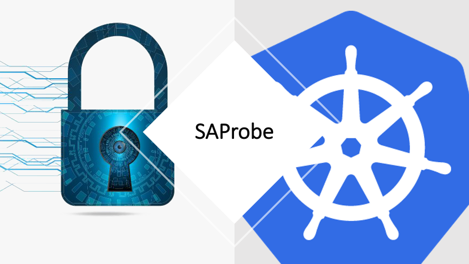

# SAProbe #

Have you ever wondered, in a Kubernetes cluster, if the "service accounts" that are being mounted on the pods have access to "Secrets" stored in un-encrypted etcd database, and ConfigMaps (and they shouldn't)? Sometimes your Kubernetes user's permission may be configured according to least-privilege principle, but that might not be the case for some "service accounts". Sometimes such service accounts were created "Not Accidentally".

 

## About the Tool

SAProbe is a script that scans Kubernetes pods and discovers Secrets and ConfigMaps using the permission of "Service Accounts" mounted on each pod in a namespace. This tool will allow you to discover which Secrets or ConfigMaps are exposed. It'll allow you to know whether any excessive role or clusterrole are being bound to service account that is used by the pods in a namespace. 

Download the tool here - [sa_probe.sh](scripts/sa_probe.sh).

> Note: This will only work on linux Pods which have `curl` installed.

## Pre-requisites
- SAProbe script will use Kubernetes command-line tool **kubectl**. ( Download `kubectl` [here](https://kubernetes.io/docs/tasks/tools/) if the system you will run the tool on does not already have it.)

- The Kubernetes user does not need to have access to Secrets and ConfigMaps. But the user needs to have `get` access on pods, and be able to `exec` into pods.

### How to 

- Once you've downloaded the [script](scripts/sa_probe.sh), update the $NAMESPACE variable according to your requirement. The default value is `default`. 

```bash
NAMESPACE=default
```

- Simply execute the script

```bash
./sa_probe.sh
```

### Expected Output

You will probably see a rather lengthy report because SAProbe runs against each and every pod it can find. It will return all Secrets, ConfigMaps discovered using the permission of service accounts mounted on pods in a namespace. 

If you scroll through it, you might probably find secrets stored in un-encrypted `etcd` database like the one below:

```bash

    {
      "metadata": {
        "name": "mysecret",
        "namespace": "default",
        "selfLink": "/api/v1/namespaces/default/secrets/mysecret",
        "uid": "fc921e0e-4c0f-4709-b560-a2f8b8c83641",
        "resourceVersion": "2551267",
        "creationTimestamp": "2021-08-01T12:12:09Z",
        "managedFields": [
          {
            "manager": "kubectl",
            "operation": "Update",
            "apiVersion": "v1",
            "time": "2021-08-01T12:12:09Z",
            "fieldsType": "FieldsV1",
            "fieldsV1": {"f:data":{".":{},"f:password":{},"f:username":{}},"f:type":{}}
          }
        ]
      },
      "data": {
        "password": "UEBzc3cwcmQ=",
        "username": "Z3Jvb3Q="
      },
      "type": "Opaque"
    },


```

You can grab the secret value which is encoded. And you can do the following and get the base64 decoded value.

```bash
echo UEBzc3cwcmQ= | base64 -d
P@ssw0rd
```

> Note: ALWAYS encrypt your `etcd` to avoid exposure like this!

SAProbe is designed to discover exposed **Secrets** and **ConfigMaps**, using the permission of Service Accounts mounted on pods. And if you see Secrets and ConfigMaps are exposed when they shouldn't be, that means you have excessive permission issues with the roles that are attached to service accounts! Time to tighten RBAC and encrypt `etcd`!

### About the Author 
Jayden Kyaw Htet Aung is a cloud security lead architect currently working for a multi-national bank. This is his weekend project and his development work in the tool is not related to the bank.

- Twitter: [@JaydenAung](https://twitter.com/JaydenAung)
- LinkedIn: https://www.linkedin.com/in/jaydenaung/ 


